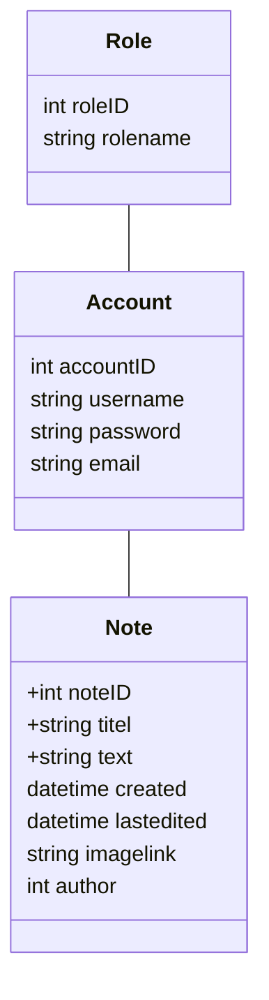

# Design Class Diagram over noteprojektet

```mermaid
---

---
classDiagram

Note : +int noteID
Note : +string titel
Note : +string text
Note : datetime created
Note : datetime lastedited
Note : string imagelink
Note : int author

Role : int roleID
Role : string rolename

Account : int accountID
Account : string username
Account : string password
Account : string email

Role -- Account
Account -- Note

```