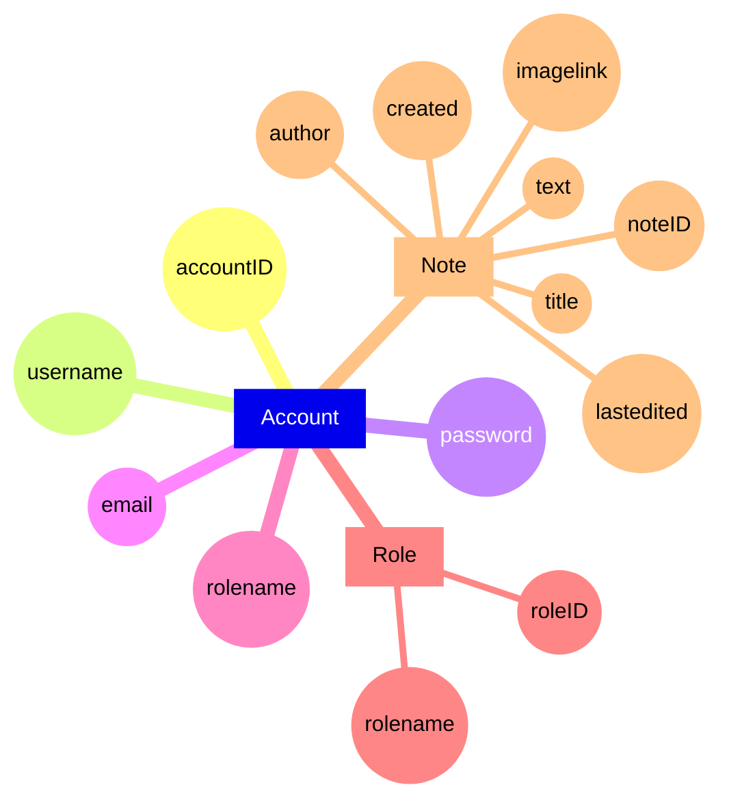
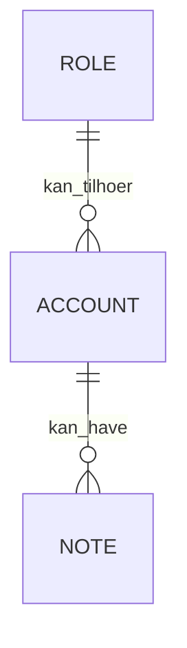

# E/R Diagram over databasen
## Mangler rhombus der beskriver forholdet fordi mermaid mangler det (eller kunne måske ikke finde ud af det). Det samme gælder attributerne (ovalformen kunne ikke findes) Brugt også mindmap graphing. Beskrivelsen af forholdene følger.
- Role og Account: En role kan tilhøre 0 eller flere konti men en konto behøver ikke nogen role. 
- Account og Note: En konto kan have 0 eller flere noter. Men en note skal tilhøre en konto.  
- Den fysisk data modelen viser det tydeligt. 

## Mulighed 2 er en ER diagram uden attributer. Attributerne kan ses i den fysiske model samt deres egenskaber. 


# Physical data model

```mermaid
erDiagram
    ACCOUNT ||--o{ NOTE : creates
    ROLE ||--o{ ACCOUNT : is
    NOTE {
        INT noteID(PK not null)
        VARCHAR(255) title(not null)
        TEXT text
        DATETIME created(not null)
        DATETIME lastedited
        VARCHAR(255) imagelink
        INT author(FK not null)
    }
    ACCOUNT {
        INT accountID(PK not null)
        VARCHAR(255) username(not null)
        VARCHAR(255) password(not null)
        VARCHAR(255) email(not null)
        VARCHAR(255) rolename
    }
    ROLE {
        INT roleID(PK not null)
        VARCHAR(255) rolename
    }
```