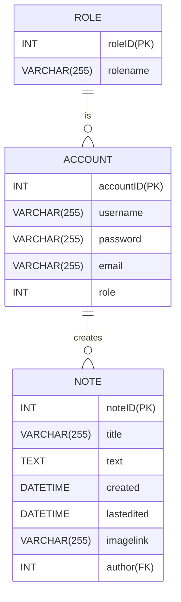

# E/R Diagram over databasen
## Mangler rhombus der beskriver forholdet fordi mermaid mangler det (eller kunne måske ikke finde ud af det). Det samme gælder attributerne (ovalformen kunne ikke findes) Brugt også mindmap graphing. Beskrivelsen af forholdene følger.
- Role og Account: En role kan tilhøre 0 eller flere konti.
- Account og Note: En konto kan have 0 eller flere noter. 
- Den fysisk data modelen viser det tyde

## Mulighed 2 er en ER diagram uden attributer. Attributerne kan ses i den fysiske model samt deres egenskaber. 

# Physical data model

