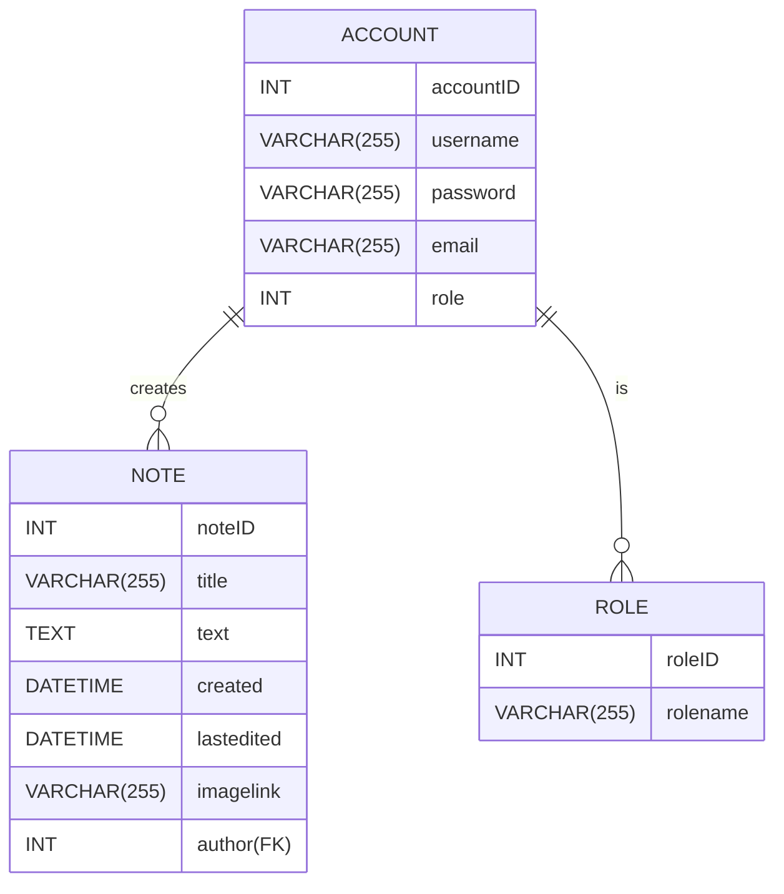
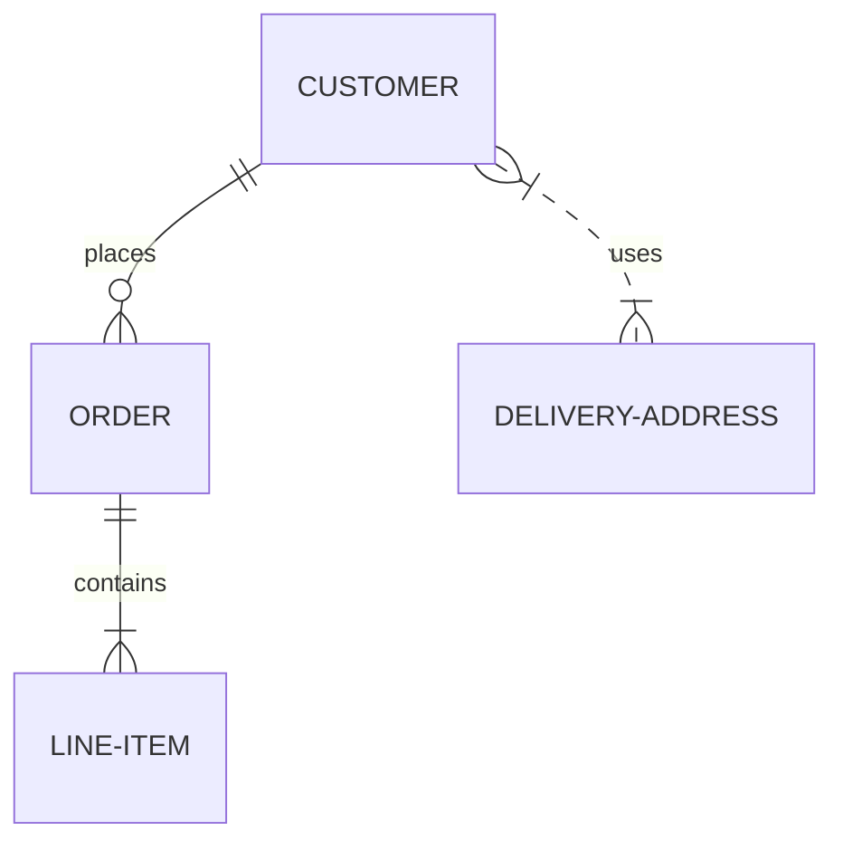

# E/R Diagram over databasen

```mermaid
erDiagram
    ACCOUNT ||--o{ NOTE : creates
    ACCOUNT ||--o{ ROLE : is
    NOTE {
        INT noteID
        VARCHAR(255) title
        TEXT text
        DATETIME created
        DATETIME lastedited
        VARCHAR(255) imagelink
        INT author(FK)
    }
    ACCOUNT {
        INT accountID
        VARCHAR(255) username
        VARCHAR(255) password
        VARCHAR(255) email
        INT role
    }
    ROLE {
        INT roleID
        VARCHAR(255) rolename
    }
```

```mermaid
erDiagram
    CUSTOMER ||--o{ ORDER : places
    ORDER ||--|{ LINE-ITEM : contains
    CUSTOMER }|..|{ DELIVERY-ADDRESS : uses
```