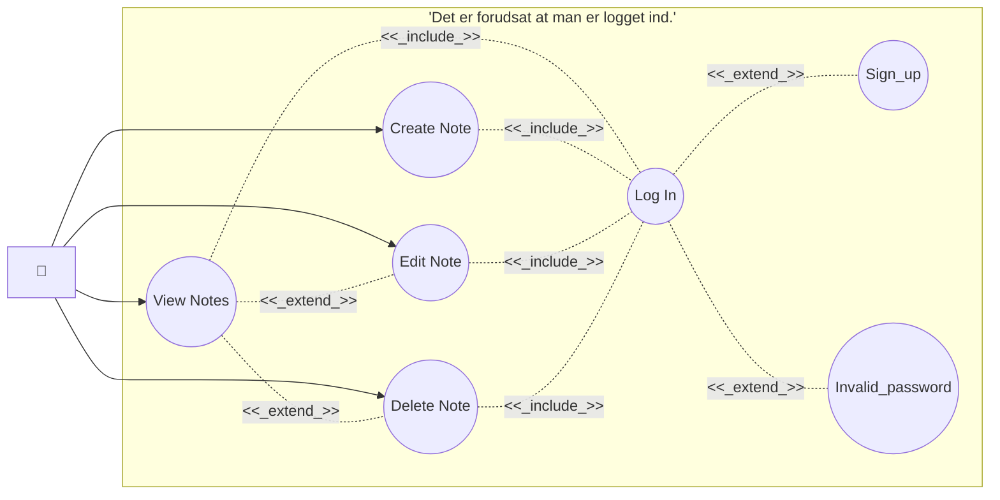

## Flowchart brugt fordi mermaid har ingen indbygget usecase diagrammer. 

```mermaid
flowchart LR
    subgraph 'Det er forudsat at man er logget ind.'
    a((Log In))
    b((View Notes))
    c((Create Note))
    d((Edit Note))
    e((Delete Note))
    f((Sign_up))
    g((Invalid_password))

    end
    user[👿]


    user --> b
    user --> c
    user --> d
    user -->e


    b-.<<_include_>>.-a
    c-.<<_include_>>.-a
    d-.<<_include_>>.-a
    e-.<<_include_>>.-a
    b-.<<_extend_>>.-d
    b-.<<_extend_>>.-e 
    a-.<<_extend_>>.-f
    a-.<<_extend_>>.-g
```